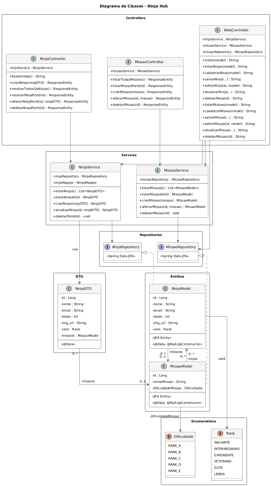

# Ninja Hub

API de cadastro de ninjas feita com Spring Boot, com interface web em Thymeleaf e endpoint REST documentado no Swagger.

> O frontend (HTML/CSS/Thymeleaf) foi feito com auxílio de IA. O backend foi todo programado por mim durante o curso Java 10x.

## Rodando local

Precisa de Java 21+.

```bash
./mvnw spring-boot:run
```

Ou se preferir buildar o jar:

```bash
./mvnw package -DskipTests
java -jar target/CadastroNinjasAPI-0.0.1-SNAPSHOT.jar
```

Depois abre http://localhost:8080/web/ no navegador.

## O que tem

**Interface web** (`/web/`):
- Dashboard com stats e ninjas recentes
- CRUD de ninjas (nome, email, idade, rank, missão vinculada)
- CRUD de missões com nível de dificuldade

**API REST**:
- `/ninjas/listar`, `/ninjas/criar`, `/ninjas/alterar/{id}`, `/ninjas/deletar/{id}`
- `/missoes/listar`, `/missoes/criar`, `/missoes/alterar/{id}`, `/missoes/deletar/{id}`

**Documentação**: `/swagger-ui.html`

**Console H2**: `/h2-console`

## Stack

- Java 21 + Spring Boot 4.1
- Thymeleaf (frontend server-side)
- H2 Database
- Flyway (migrações do banco)
- SpringDoc OpenAPI (Swagger)
- Docker multi-stage build

## Diagrama de Classes



## Estrutura

```
src/main/java/dev/java10x/CadastroDeNinjas/
├── Ninjas/          # Ninja (entity, service, controller, DTO)
├── Missoes/         # Missao (entity, service, controller)
└── WebController    # Rotas do frontend
```
